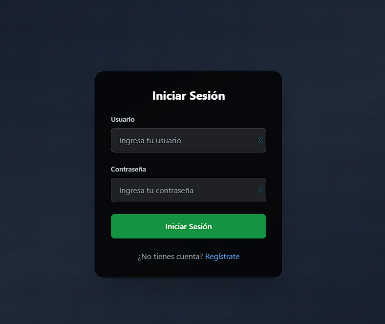
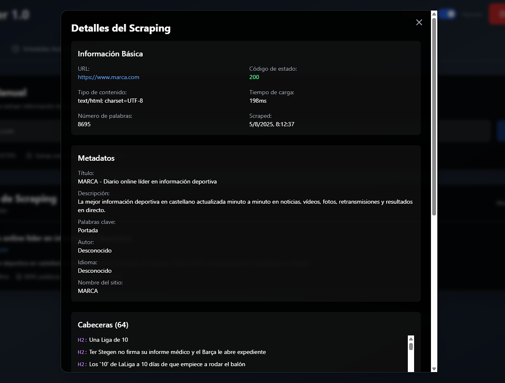

# WebScraper App

Un proyecto Full‑Stack con propósito formativo para extraer metadatos, links, imágenes y contenido de páginas web, con Go en el backend y React + Tailwind CSS en el frontend. Incluye autenticación JWT y almacenamiento de resultados por usuario en SQLite.


## Índice
- [Características](#características)
- [Estructura del Proyecto](#estructura-del-proyecto)
- [Requisitos](#requisitos)
- [Arquitectura](#arquitectura)
  - [Domain Layer](#domain-layer)
  - [Use Case Layer](#use-case-layer)
  - [Infrastructure Layer](#infrastructure-layer)
  - [Presentation Layer](#presentation-layer)
- [Dependencias](#dependencias)
- [Instalación y Uso](#instalación-y-uso)
- [Flujo de Uso](#flujo-de-uso)


## Características
- Clean Architecture (Domain, Use Cases, Infrastructure)
- Interfaz web hecha con React
- Persistencia SQLite sin CGO
- Configuración mediante archivo YAML
- API REST para operaciones CRUD


## Estructura del Proyecto

```
/
├── config.yaml              # Configuración de servidor, BD, scraping y auth
├── data/                    # Base de datos SQLite (scraper.db)
├── internal/
│   ├── config/              # Carga de YAML
│   ├── domain/
│   ├── infrastructure/
│   │   ├── database/        # SQLite + migraciones
│   │   ├── repository/      # Implementación de repositorios
│   │   └── web/             # Servidor HTTP y middleware
│   └── usecase/             # Lógica de negocio
├── main.go                  # Punto de entrada del backend
├── go.mod, go.sum           # Dependencias Go
└── webscrapper-frontend/    # Proyecto React + Tailwind
    ├── public/
    ├── src/
    ├── package.json
    └── tailwind.config.js
```


## Requisitos
- Go ≥ 1.24
- Node.js ≥ 16 y npm
- SQLite (integrado en Go con modernc.org/sqlite)


## Arquitectura
### Domain Layer
- `entity/scraping.go`: Entidad ScrapingResult
- `entity/user.go`: Entidad User
- `repository/scraping.go`: Interface del repositorio de Scraping
- `repository/user.go`: Interfaz del repositorio de User

### Use Case Layer
- `usecase/scraping.go`: Lógica de negocio para Scraping
- `usecase/auth.go`: Lógica para la autenticación de usuarios

### Infrastructure Layer
- `database/sqlite.go`: Conexión SQLite
- `persistence/scraping_repository.go`: Implementación del repositorio de Scraping
- `persistence/user_repository.go`: Implementación del repositorio de User
- `web/server.go`: Servidor HTTP y handlers
- `web/middleware.go`: Middleware JWT (RequireAuth, OptionalAuth, roles)

### Presentation Layer
- Frontend hecho con React, usando componentes

## Dependencias
Go
- `github.com/gorilla/mux`: Router HTTP
- `golang.org/x/net`: Parsing HTML
- `gopkg.in/yaml.v3`: Configuración YAML
- `modernc.org/sqlite`: Driver SQLite sin CGO
- `github.com/golang-jwt/jwt/v5`: JWT
- `golang.org/x/crypto/bcrypt`: Hash de contraseñas

Frontend
- `react, react-dom, react-scripts`
- `tailwindcss@^3.4.17`: Utilidades CSS


## Instalación y Uso
1. Copia y ajusta config.yaml:
   
```yaml
server:
  port: "8080"

database:
  path: "./data/scraper.db"

scraping:
  user_agent: "WebScraper/1.0"
  timeout: 30
  max_redirects: 10
  extract_images: true
  extract_favicon: true
  extract_headers: true
  max_links: 100
  max_images: 50

features:
  enable_analytics: true
  enable_caching: false
  cache_duration: 3600

auth:
  require_auth: true
  jwt_secret: "tu_secreto_seguro"
  token_duration_hours: 24
  default_role: "user"
```
NOTA: Asegúrate de tener creada la carpeta data/ o déjalo al inicializar.

2. **Levantar el backend**
   
```bash
cd <ruta-del-proyecto>
go run main.go
```
- Lee config.yaml.
- Crea/actualiza data/scraper.db con tablas y trigger.
- Inicia servidor en http://localhost:8080.

3. **Levantar el frontend**
   
```bash
cd webscrapper-frontend
npm install
npm start
```
- Usa proxy a http://localhost:8080 (definido en package.json).
- Abre http://localhost:3000.


## Flujo de Uso
1. Registro: POST /api/auth/register

```json
{ "username":"usuario", "email":"u@ej.com", "password":"secret" }
```

<figure>
  
  <figcaption>Figura 1. Pantalla de Registro de usuario</figcaption>
</figure>

  
2. Login: POST /api/auth/login

```json
{ "username":"usuario", "password":"secret" }
```
Recibirás { message, data: { token, user, expires_at } }.
El token se guarda en localStorage.

<figure>
  
  <figcaption>Figura 2. Pantalla de Autenticación del usuario</figcaption>
</figure>

  
3. Scraping: POST /api/scrape

```json
{ "url":"https://ejemplo.com" }
```
Devuelve el objeto ScrapingResult y lo persiste asociado al usuario.

Listar resultados: GET /api/results
Solo devuelve los scrapes del usuario autenticado.

<figure>
    
    <figcaption>Figura 3. Pantalla de resultados scrapeados</figcaption>
</figure>

  
4. Detalles 
- /eliminación
- GET /api/results/{id}
- DELETE /api/results/{id}

<figure>
    
    <figcaption>Figura 4. Pantalla de diálogo modal con los resultados de una web</figcaption>
</figure>

  
5. Health check: GET /api/health


## Autoría
Desarrollado por Antonio Ortega.

## Licencia
Proyecto desarrollado con fines educativos/formativos.
