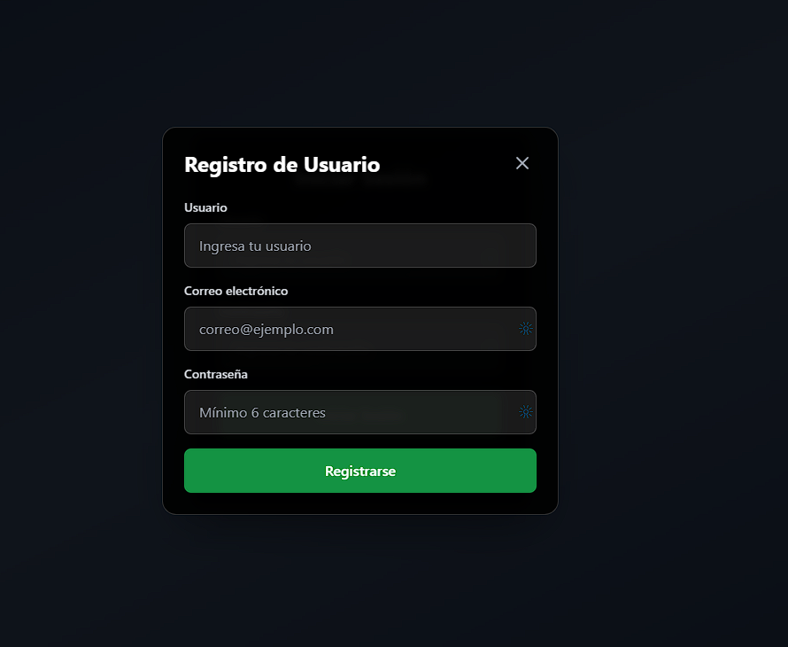

# WebScraper App

Un proyecto Full‑Stack con propósito formativo para extraer metadatos, links, imágenes y contenido de páginas web, con Go en el backend y React + Tailwind CSS en el frontend. Incluye autenticación JWT completa, programación de tareas con cron y almacenamiento de resultados por usuario en SQLite.


## Índice
- [WebScraper App](#webscraper-app)
  - [Índice](#índice)
  - [El Viaje de Aprendizaje](#el-viaje-de-aprendizaje)
  - [Lo que realmente aprendí](#lo-que-realmente-aprendí)
  - [Características](#características)
  - [Estructura del Proyecto](#estructura-del-proyecto)
  - [Requisitos](#requisitos)
  - [Arquitectura](#arquitectura)
    - [Domain Layer](#domain-layer)
    - [Infrastructure Layer](#infrastructure-layer)
    - [Use Case Layer](#use-case-layer)
    - [Presentation Layer](#presentation-layer)
    - [Frontend hecho con React, usando componentes](#frontend-hecho-con-react-usando-componentes)
  - [Dependencias](#dependencias)
  - [Instalación y Uso](#instalación-y-uso)
    - [Setup para nuevos desarrolladores](#setup-para-nuevos-desarrolladores)
  - [Endpoints de la API](#endpoints-de-la-api)
    - [Autenticación](#autenticación)
    - [Scraping](#scraping)
    - [Programación](#programación)
    - [Administración](#administración)
    - [Otros](#otros)
  - [Flujo de Uso](#flujo-de-uso)
  - [Autoría](#autoría)
  - [Licencia](#licencia)


## El Viaje de Aprendizaje
Este proyecto nació como un Trabajo de Fin Grado, comenzando de forma muy básica: un backend ligero con un frontend SPA hecho con HTML, CSS y JavaScript vanilla. Aunque simple en apariencia, no careció de desafíos iniciales que despertaron mi curiosidad por el mundo del web scraping.

Una vez presentado y evaluado exitosamente, me di cuenta de que tenía entre mis manos algo con potencial a largo plazo. Me había propuesto entender realmente cómo funcionaba la extracción de datos web, y esta era la mejor forma de conseguirlo. 

Los comienzos fueron duros. Decidí cambiar completamente el stack tecnológico, pasando de Java/Kotlin a Go. Este salto implicó enfrentarme a una nueva sintaxis, la gestión de punteros(algo completamente nuevo viniendo de Java), el no uso de modificadores de acceso (al menos de forma explícita), concurrencia con goroutines, etc.

Probablemente la mayor dificultad la encontré al intentar entender e implementar Clean Architecture. Venía acostumbrado al típico MVC de toda la vida, donde todo era más directo y menos abstracto.
Clean Architecture me obligó a pensar en capas de abstracción reales, implementar inversión de dependencias manualmente,
separar lógica de negocio de infraestructura (sigue siendo dificil), o crear interfaces como contratos y no como herencia.
Fue frustrante al principio, pero al final entendí la escalabilidad que proporciona a tus proyectos así como sus beneficios.

Cuando mi frontend se quedó pequeño, llegó el momento de otra nueva decisión: React.js vs Angular.
Tras investigar ambos frameworks y sacar mis conclusiones:
- Angular: Potente pero pesado, mayor curva de aprendizaje.
- React: Más directo, enfoque funcional, ecosistema maduro.

Al final me decanté por React. A pesar de no estar muy bien implementados en el proyecto, comprendí los beneficios de usar hooks para cambiar los estados y ciclos de vida de los componentes.

## Lo que realmente aprendí
Más allá de las tecnologías, este proyecto me enseñó:

Perseverancia técnica: Cuando algo no funciona, hay que seguir iterando, e iterando, e iterando, etc ....
Arquitectura pensada: No es solo hacer que funcione, sino que funcione bien.
Toma de decisiones: Evaluar tecnologías y elegir la más adecuada.
Evolución gradual: Un proyecto puede crecer y transformarse completamente.


## Características
- **Clean Architecture** (Domain, Use Cases, Infrastructure, Presentation)
- **Interfaz web** hecha con React + Tailwind CSS
- **Persistencia SQLite** sin CGO con migraciones automáticas
- **Configuración** mediante archivo YAML
- **API REST** completa para operaciones CRUD
- **Autenticación JWT** con roles, refresh tokens y logout seguro
- **Scraping programado** con expresiones cron y gestión de jobs
- **Paginación** de resultados de scraping
- **Middleware** de logging, CORS y control de acceso
- **Extracción completa** de metadatos, links, imágenes y contenido

## Estructura del Proyecto

```
/
├── README.md                              # Documentación del proyecto
├── .gitignore                             # Archivos ignorados por Git
├── assets/                                # Imágenes y recursos del README
├── server/                                # Backend Go con Clean Architecture
│   ├── config.yaml                        # Configuración de servidor, BD, scraping y auth
│   ├── main.go                            # Punto de entrada del backend
│   ├── generate_secret.go                 # Generador de secretos JWT
│   ├── Makefile                           # Comandos de build y desarrollo
│   ├── go.mod, go.sum                     # Dependencias Go
│   ├── data/                              # Base de datos SQLite (scraper.db)
│   ├── internal/
│   │   ├── domain/
│   │   │   ├── entity/                    # Modelos para la lógica del negocio
│   │   │   │   ├── pagination.go          # Entidades de paginación
│   │   │   │   ├── schedule.go            # Entidad Schedule y DTOs
│   │   │   │   ├── scraping.go            # Entidad ScrapingResult
│   │   │   │   └── user.go                # Entidad User y DTOs de auth
│   │   │   └── repository/                # Interfaces de repositorios
│   │   │       ├── schedule.go            # Interface ScheduleRepository
│   │   │       ├── scraping.go            # Interface ScrapingRepository
│   │   │       ├── token_repository.go    # Interface TokenRepository
│   │   │       └── user.go                # Interface UserRepository
│   │   ├── infrastructure/
│   │   │   ├── config/                    # Carga de configuración YAML
│   │   │   │   └── config.go              # Parser de config.yaml
│   │   │   ├── database/                  # SQLite + migraciones automáticas
│   │   │   │   └── sqlite.go              # Conexión y creación de tablas
│   │   │   └── persistence/               # Implementación de repositorios
│   │   │       ├── in_memory_token_repository.go  # Blacklist de tokens
│   │   │       ├── schedule_repository.go         # Repositorio de Schedule
│   │   │       ├── scraping_repository.go         # Repositorio de Scraping
│   │   │       └── user_repository.go             # Repositorio de User
│   │   ├── usecase/                       # Lógica de negocio
│   │   │   ├── auth.go                    # Casos de uso de autenticación
│   │   │   ├── schedule.go                # Casos de uso de programación
│   │   │   └── scraping.go                # Casos de uso de scraping
│   │   └── presentation/
│   │       ├── server/                    # Servidor HTTP principal
│   │       │   └── server.go              # Inicialización y configuración
│   │       ├── routes/                    # Configuración centralizada de rutas
│   │       │   └── routes.go              # Setup de todas las rutas
│   │       ├── handlers/                  # Controladores HTTP
│   │       │   ├── auth.go                # Handlers de autenticación
│   │       │   ├── common.go              # Handlers comunes (health, index)
│   │       │   ├── schedule.go            # Handlers de programación
│   │       │   └── scraping.go            # Handlers de scraping
│   │       ├── middleware/                # Middleware de la aplicación
│   │       │   ├── auth.go                # JWT, roles y autenticación
│   │       │   ├── common.go              # Logging, CORS, content-type
│   │       │   └── rate_limiter.go        # Rate limiting por IP
│   │       └── response/                  # Helpers para respuestas HTTP
│   │           └── helpers.go             # Respuestas estandarizadas
│   └── pkg/                               # Paquetes compartidos
│       ├── crypto/                        # Utilidades de criptografía
│       │   └── password.go                # Hash y validación de contraseñas
│       ├── errors/                        # Errores personalizados
│       │   └── errors.go                  # Tipos de error del dominio
│       └── validator/                     # Validaciones
│           └── validator.go               # Validador de entradas
└── client/                                # Frontend React + Vite + Tailwind
    ├── index.html                         # HTML principal
    ├── package.json                       # Dependencias frontend
    ├── pnpm-lock.yaml                     # Lockfile de pnpm
    ├── vite.config.js                     # Configuración de Vite
    ├── tailwind.config.js                 # Configuración de Tailwind CSS
    ├── postcss.config.js                  # Configuración de PostCSS
    ├── eslint.config.js                   # Configuración de ESLint
    ├── public/
    │   └── vite.svg                       # Logo de Vite
    └── src/
        ├── main.jsx                       # Punto de entrada del frontend
        ├── App.jsx                        # Componente principal
        ├── index.css                      # Estilos globales
        ├── api/
        │   └── client.js                  # Cliente HTTP para la API
        ├── components/                    # Componentes React
        │   ├── Alert.jsx                  # Sistema de alertas
        │   ├── DetailModal.jsx            # Modal de detalles de scraping
        │   ├── HealthIndicator.jsx        # Indicador de estado del servidor
        │   ├── LoadingSpinner.jsx         # Spinner de carga
        │   ├── LoginView.jsx              # Vista de login
        │   ├── MainView.jsx               # Vista principal de la app
        │   ├── PaginatedResultsList.jsx   # Lista de resultados con paginación
        │   ├── Pagination.jsx             # Controles de paginación
        │   ├── RegisterModal.jsx          # Modal de registro
        │   ├── ResultsList.jsx            # Lista simple de resultados
        │   ├── ScheduleList.jsx           # Lista de schedules
        │   ├── ScheduleModal.jsx          # Modal para crear/editar schedules
        │   ├── ScheduleSection.jsx        # Sección de schedules
        │   └── ScrapeForm.jsx             # Formulario de scraping
        ├── contexts/                      # Contextos de React
        │   ├── index.jsx                  # Barrel export de contextos
        │   ├── AlertContext.jsx           # Contexto de alertas
        │   ├── AuthContext.jsx            # Contexto de autenticación
        │   ├── ResultsContext.jsx         # Contexto de resultados
        │   └── ScheduleContext.jsx        # Contexto de schedules
        └── hooks/                         # Custom hooks
            ├── usePagination.jsx          # Hook de paginación
            └── useSchedules.js            # Hook de schedules
```

## Requisitos
- Go ≥ 1.24
- Node.js ≥ 18 y pnpm
- SQLite (incluido vía `modernc.org/sqlite`, sin CGO)

## Arquitectura

### Domain Layer
- `entity/pagination.go`: Entidades para paginación de resultados
- `entity/schedule.go`: Entidad Schedule con DTOs de creación y actualización
- `entity/scraping.go`: Entidad ScrapingResult con headers estructurados
- `entity/user.go`: Entidad User con DTOs de login, registro y respuesta de auth
- `repository/schedule.go`: Interface del repositorio de Schedule
- `repository/scraping.go`: Interface del repositorio de Scraping con paginación
- `repository/user.go`: Interface del repositorio de User

### Infrastructure Layer
- `database/sqlite.go`: Conexión SQLite con creación automática de tablas, índices y triggers
- `persistence/schedule_repository.go`: Implementación completa del repositorio de Schedule
- `persistence/scraping_repository.go`: Implementación del repositorio de Scraping con paginación
- `persistence/user_repository.go`: Implementación del repositorio de User con validaciones

### Use Case Layer
- `usecase/auth.go`: Lógica completa de autenticación con JWT, refresh tokens, blacklist y limpieza automática
- `usecase/schedule.go`: Lógica de programación con cron jobs, gestión de scheduler y ejecución automática
- `usecase/scraping.go`: Lógica de negocio para scraping con paginación

### Presentation Layer
- `presentation/server/server.go`: Servidor HTTP con inicialización de todos los componentes
- `presentation/routes/routes.go`: Configuración centralizada de rutas con middleware aplicado por grupos
- `presentation/handlers/auth.go`: Controladores HTTP para registro, login, logout, refresh y perfil
- `presentation/handlers/common.go`: Controladores HTTP para health check, index y 404
- `presentation/handlers/schedule.go`: Controladores HTTP para CRUD completo de programación
- `presentation/handlers/scraping.go`: Controladores HTTP para scraping y gestión de resultados con paginación
- `presentation/middleware/auth.go`: Middleware JWT con soporte para roles, autenticación opcional y blacklist
- `presentation/middleware/common.go`: Middleware de logging, CORS y content-type
- `presentation/response/helpers.go`: Helpers para respuestas HTTP estandarizadas

### Frontend hecho con React, usando componentes

## Dependencias

**Backend (Go)**
- `github.com/robfig/cron/v3`: Programación de tareas con expresiones cron y soporte para segundos
- `github.com/gorilla/mux`: Router HTTP con soporte para variables de ruta y middleware
- `golang.org/x/net`: Parsing HTML y herramientas de red para scraping
- `gopkg.in/yaml.v3`: Configuración YAML con unmarshaling automático
- `modernc.org/sqlite`: Driver SQLite sin CGO con rendimiento optimizado
- `github.com/golang-jwt/jwt/v5`: Generación, validación y parsing de tokens JWT
- `golang.org/x/crypto/bcrypt`: Hash seguro de contraseñas con cost configurable

**Frontend**
- `react@^19.0.0, react-dom@^19.0.0`: Framework React para interfaz de usuario
- `vite@^6.0.5`: Build tool y dev server ultrarrápido
- `tailwindcss@^3.4.17`: Framework de utilidades CSS para diseño responsive
- `@vitejs/plugin-react@^4.3.4`: Plugin oficial de React para Vite

## Instalación y Uso

### Setup para nuevos desarrolladores

1. **Clonar el repositorio**

```bash
git clone https://github.com/Elisandil/webscraper-v2
cd webscraper-v2
```

2. **Configurar el backend**

```bash
cd server
cp config.yaml.example config.yaml

# Generar un JWT secret seguro
openssl rand -base64 32

# Editar config.yaml y pegar el secret generado en jwt_secret
nano config.yaml
```

El archivo `config.yaml` debe tener esta estructura:

```yaml
server:
  port: "8080"

database:
  path: "./data/scraper.db"

scraping:
  user_agent: "WebScraper/1.0 (Enhanced Edition)"
  timeout: 30
  max_redirects: 10
  extract_images: true
  extract_favicon: true
  extract_headers: true
  max_links: 100
  max_images: 50

features:
  enable_analytics: true
  enable_caching: false
  cache_duration: 3600

auth:
  require_auth: true
  jwt_secret: "PEGAR_AQUI_EL_SECRET_GENERADO"
  token_duration_hours: 24
  default_role: "user"
```

**IMPORTANTE:** 
- El archivo `config.yaml` **NO** está en Git por seguridad
- Siempre usa `config.yaml.example` como referencia
- Genera un secret único para cada entorno

3. **Instalar dependencias y levantar el backend**

```bash
go mod download

go run main.go # creará data/ y scraper.db automáticamente
```

El backend:
- Lee la configuración desde `config.yaml`
- Crea automáticamente `data/scraper.db` con tablas, índices y triggers
- Inicia el scheduler para tareas programadas
- Sirve en `http://localhost:8080`

4. **Configurar y levantar el frontend**

```bash
cd client

pnpm install

pnpm run dev
```

El frontend:
- Usa proxy a `http://localhost:8080` (configurado en `vite.config.js`)
- Abre automáticamente `http://localhost:5173`

## Endpoints de la API

### Autenticación
- `POST /api/auth/register` - Registro de usuario
- `POST /api/auth/login` - Autenticación de usuario
- `POST /api/auth/refresh` - Renovar token JWT
- `POST /api/auth/logout` - Logout con revocación de token
- `GET /api/profile` - Obtener perfil del usuario autenticado

### Scraping
- `POST /api/scrape` - Realizar scraping de una URL
- `GET /api/results` - Listar resultados (con paginación opcional: `?page=1&per_page=10`)
- `GET /api/results/{id}` - Obtener resultado específico
- `DELETE /api/results/{id}` - Eliminar resultado

### Programación
- `POST /api/schedules` - Crear tarea programada
- `GET /api/schedules` - Listar tareas del usuario
- `GET /api/schedules/{id}` - Obtener tarea específica
- `PUT /api/schedules/{id}` - Actualizar tarea programada
- `DELETE /api/schedules/{id}` - Eliminar tarea programada

### Administración
- `GET /api/admin/*` - Endpoints administrativos (requieren rol "admin")

### Otros
- `GET /api/health` - Health check del servicio
- `GET /` - Interfaz web principal
- `GET /static/*` - Archivos estáticos

## Flujo de Uso

1. **Registro de usuario**
   
```bash
POST /api/auth/register
Content-Type: application/json

{
  "username": "usuario",
  "email": "usuario@ejemplo.com", 
  "password": "password123"
}
```



1. **Autenticación**
   
```bash
POST /api/auth/login
Content-Type: application/json

{
  "username": "usuario",
  "password": "password123"
}
```


Respuesta:
```json
{
  "message": "Login successful",
  "data": {
    "token": "eyJhbGciOiJIUzI1NiIsInR5cCI6IkpXVCJ9...",
    "user": {
      "id": 1,
      "username": "usuario",
      "email": "usuario@ejemplo.com",
      "role": "user",
      "active": true
    },
    "expires_at": "2024-01-02T15:04:05Z"
  }
}
```

El token se guarda en `localStorage` para futuras peticiones.

2. **Scraping de URLs**
   
```bash
POST /api/scrape
Authorization: Bearer <token>
Content-Type: application/json

{
  "url": "https://ejemplo.com"
}
```

Devuelve el objeto `ScrapingResult` completo y lo persiste asociándolo al usuario autenticado.

3. **Listar resultados con paginación**
   
```bash
GET /api/results?page=1&per_page=10
Authorization: Bearer <token>
```

<p>
  
  <br>
  
  
</p>

Solo devuelve los scrapes del usuario autenticado con información de paginación (opcional).


1. **Programar tareas automáticas**
   
```bash
POST /api/schedules
Authorization: Bearer <token>
Content-Type: application/json

{
  "name": "Scraping diario de noticias",
  "url": "https://ejemplo.com/noticias",
  "cron_expression": "0 0 9 * * *"
}
```

<p align="center">
  
  
</p>

La tarea se ejecutará automáticamente según la expresión cron (diariamente a las 9:00).

5. **Detalles y eliminación**
   
- `GET /api/results/{id}` - Ver detalles completos
- `DELETE /api/results/{id}` - Eliminar resultado


6. **Logout seguro**
   
```bash
POST /api/auth/logout
Authorization: Bearer <token>
```

Revoca el token añadiéndolo a la blacklist hasta su expiración natural.

7. **Health check**
   
```bash
GET /api/health
```

Verifica el estado del servicio y configuración de autenticación.

## Autoría
Desarrollado por Antonio Ortega (aog-dev).

## Licencia
Proyecto desarrollado con fines educativos/formativos.
